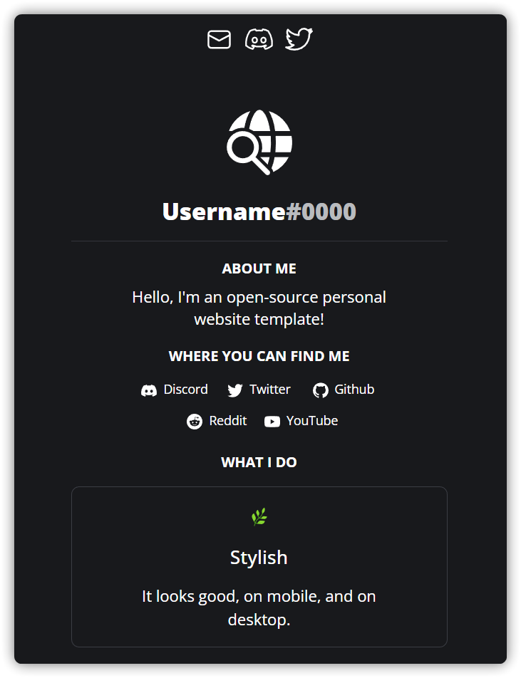

<div align="center">

<h3>Personal Website Template</h3>
This is a template for a personal website, it's pretty easy to setup.
</div>

### Table of Contents
- [Preview](#preview)
- [Setup](#setup)
    - [Deploying with Vercel](#deploying-with-vercel)
    - [Setup Guide](#setup-guide)
- [Advanced Configuration](#advanced-configuration)
- [Notes](#notes)
    - [Icons](#icons)
    - [Configurable Text/Items](#configurable-textitems)

## Preview


## Setup
#### Deploying with Vercel
If you're using Vercel to host, use this button.

[](https://vercel.com/new/clone?repository-url=https%3A%2F%2Fgithub.com%2FTurtlepaw%2Fpersonal-website)

#### Setup Guide
After that, or if you're not using vercel:

1. Go ahead and use the `Use Template` button, skip this step if you've used [the button above](#deploying-with-vercel).

2. Start off by cloning your repo (`git clone [URL]`)
3. Once you're done that, run `yarn` to install all the required packages
4. Make sure there's no errors by running `yarn dev`
5. Now, you can start configuring your site by going to `_app.tsx` and editing the `Configuration` object

6. You're almost done, deploy your site with your favorite hosting tool, you can even use [GitHub Pages](https://pages.github.com/)
7. **🎉 You're done!** If you like this template, please give it a **⭐ Star**

## Advanced Configuration
If you're looking to change some of these [Configurable Text/Items](#configurable-textitems), you can edit these by going to `_app.tsx` and changing the `Configuration` object:

```ts
export const Configuration: WebsiteConfiguration = {
  Name: "Username",
  Avatar: "/Avatar.svg",
  DiscordTag: "#0000",
  Description: "Hello, I'm an open-source personal website template!"
}
```
***Pro Tip:** Hover on a propertie (e.g. `Name`) to get more information on it.*

If you want to edit more than that, just edit the React code!

## Notes
#### Icons
If you're looking to get more of the icons provided, they are from Fluent Icons by Microsoft, I'm using [this website](https://fluenticons.co) to find and download them.
#### Configurable Text/Items
- `About me (the text)`
- `Where you can find me (all the links)`
- `What I do (all the cards)`
- `Navigation Links (located at the top of thepage)`
- `The title (default: Username)`
- `Discord Tag (default: #0000)`